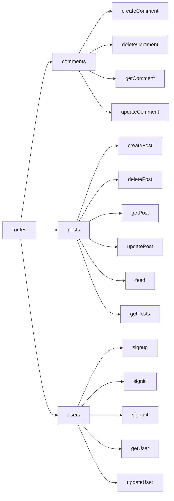

## This directory consists of routes and lambdas for the API Gateway.

If any route is causing issues for body validation even though the body is correct, then please use

```bash
yarn pushWithRefresh
```

This will refresh the stack and deploy missing/broken changes the aws.

## Routes and Lambdas



## Lambdas

- [Users Lambdas](./lambdas/users/)
- [Posts Lambdas](./lambdas/posts/)
- [Comments Lambdas](./lambdas/comments/)

## Routes

- [Users Routes](./routes/users/)
- [Posts Routes](./routes/posts/)
- [Comments Routes](./routes/comments/)
