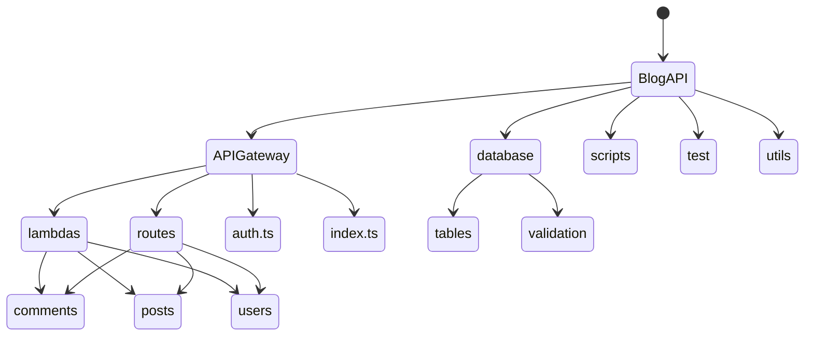

# Blog Api

## Description

Used Pulumi to create a blog api using AWS Lambda, API Gateway, and DynamoDB. The API is written in Javascript and uses the Serverless Framework to deploy the code to AWS.

### Project Structure



The API can be divided into three parts:

- [Users APIs](./APIGateway/lambdas/users/)
- [Posts APIs](./APIGateway/lambdas/posts/)
- [Comments APIs](./APIGateway/lambdas/comments/)

## Setup

### Prerequisites

- AWS Account
- Pulumi Account

### Installation

1. Clone the repository
2. Install the dependencies

```bash
yarn install
```

3. Create a new stack

```bash
pulumi stack init
```

4. Set AWS configurations

```bash
pulumi config set aws:accessKey <access-key>
pulumi config set aws:secretKey <secret-key>
pulumi config set aws:region <region>
```

**Note**: It is advised not to use root user for the access. Instead create the access from IAM and use the access key and secret key.

5. Create a new Pulumi access token

```bash
pulumi login
```

6. Deploy the stack

```bash
yarn pushWithRefresh
```

**Note**: If you are prompted with passphrases, you can use the following command to avoid the prompt This will remember the passphrase for the entire cli session

```bash
set PULUMI_CONFIG_PASSPHRASE="<passphrase>"
                  or
$env:PULUMI_CONFIG_PASSPHRASE="<passphrase>"
```

## Usage

### Create a SignUp

```bash
curl -X POST \
  https://<api-gateway-url>/signup  \
    -H 'Content-Type: application/json' \
    -d '{
      email: "someEmail@email.com",
      password: "Password1@"
    }'
```

Pulumi does not support ignoring [files](https://github.com/pulumi/pulumi/issues/9059), I added the json to this project which will also be pushed to aws which shouldn't be pushed. You should delete the json file after you have deployed the stack.

# Resources created - 220

The total resources created by the stack are **220**. The resources are divided into the following categories:

- APIs - **4**
- Functions - **33**
- Tables - **5**
- Identity - **176**

<details> 
  <summary><b>📈 Performance</b></summary>
</details>

# Todo:

- [ ] Write tests using vitest
